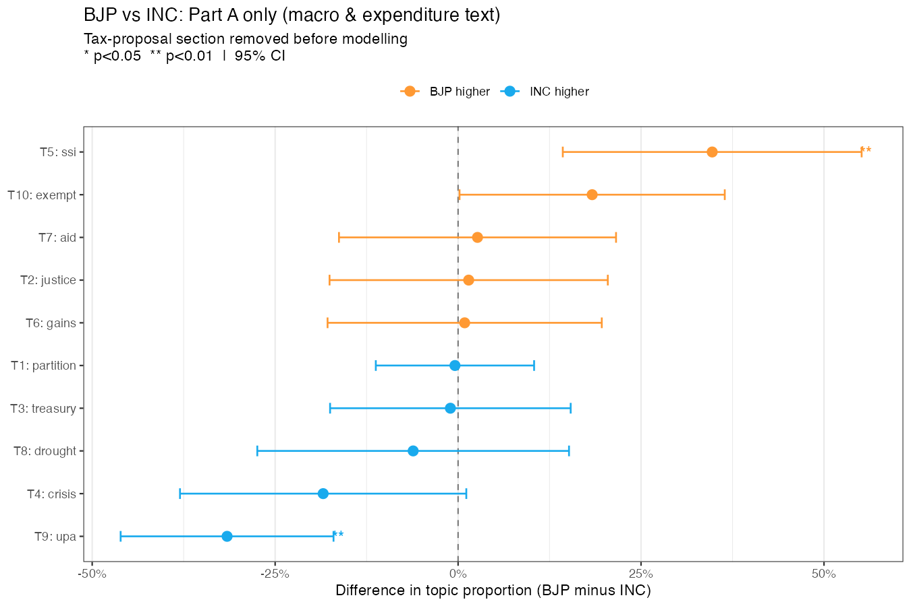
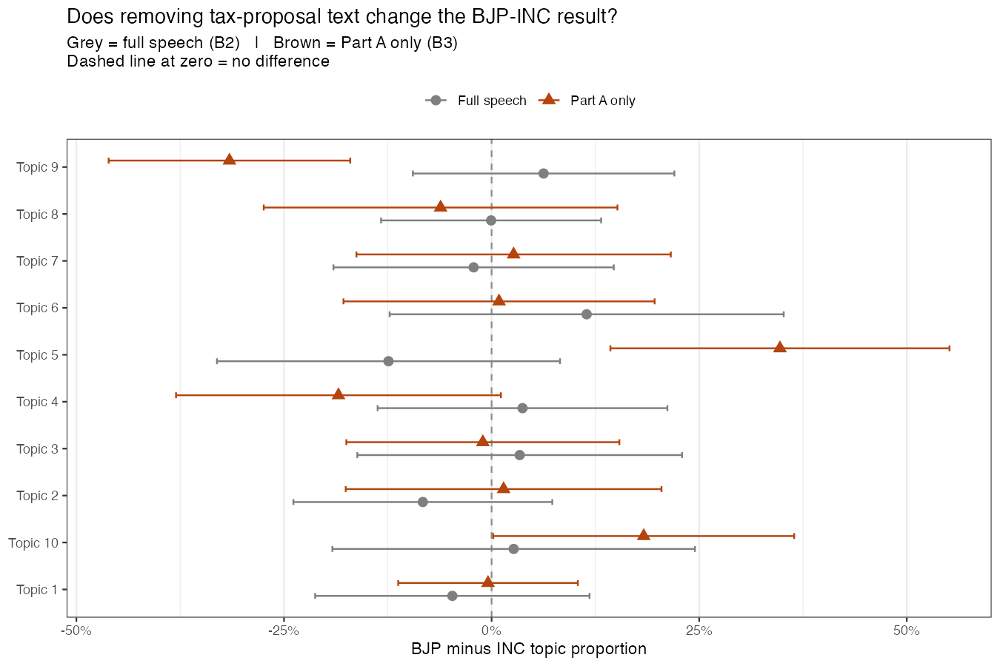
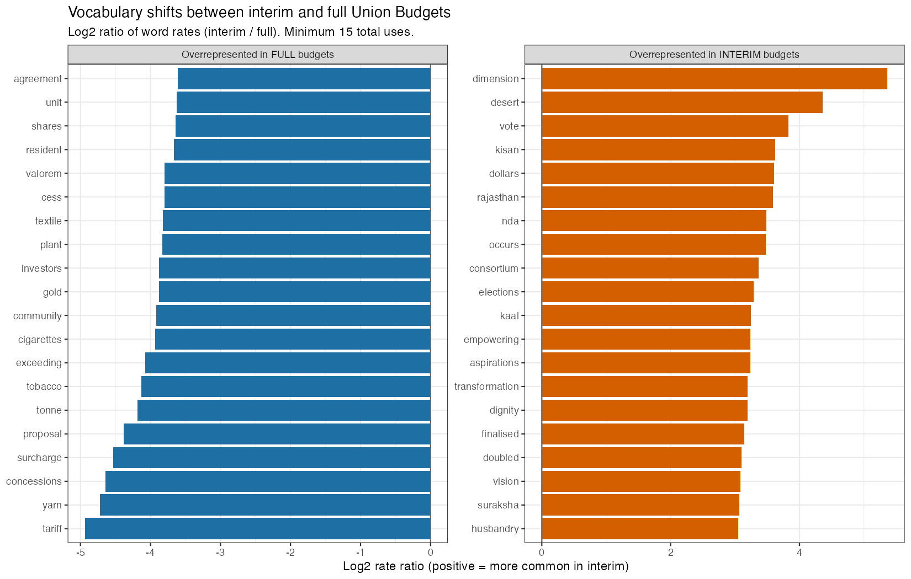
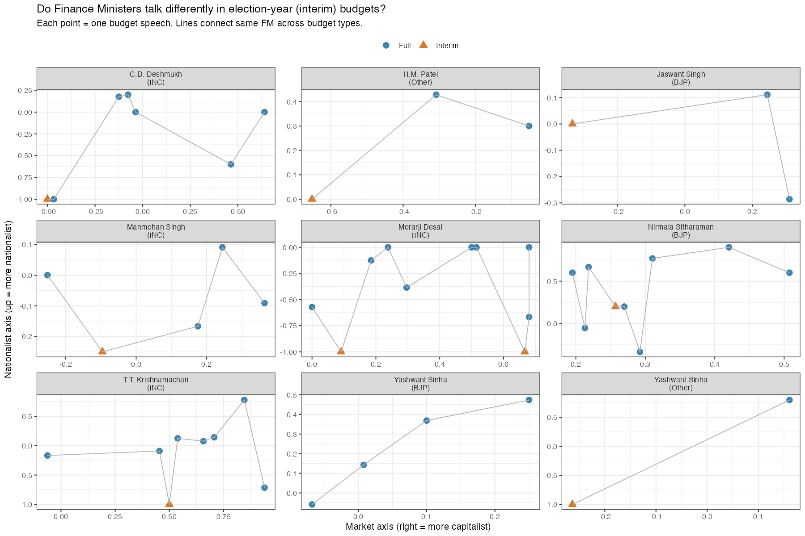
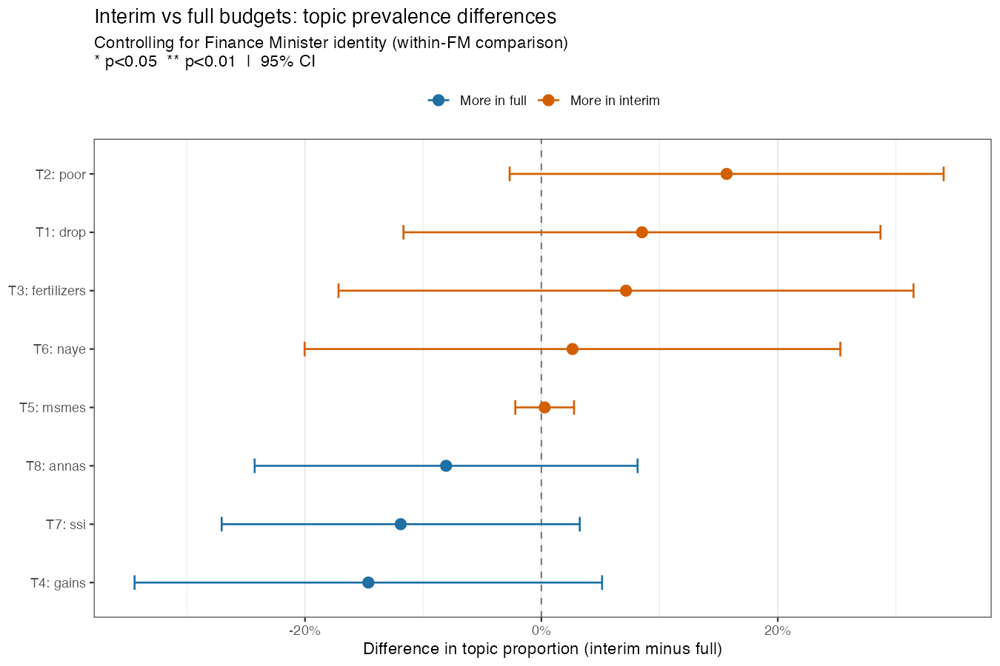
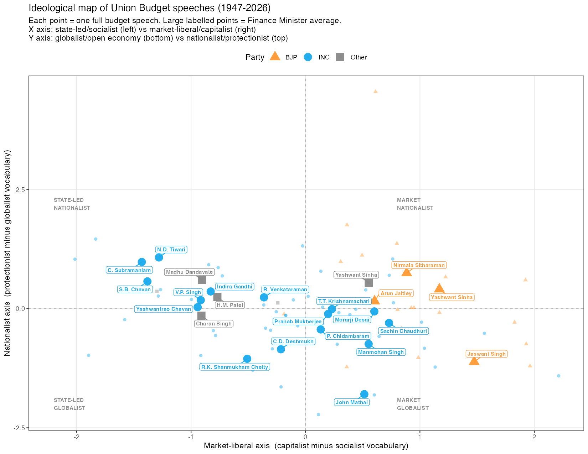
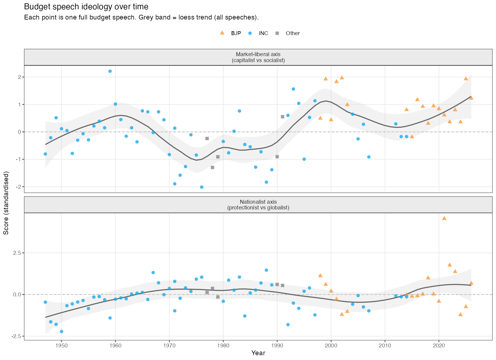
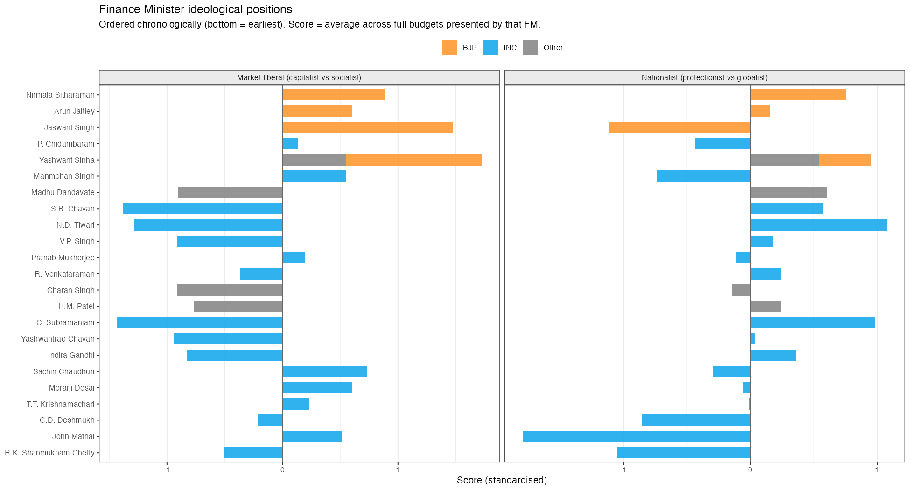
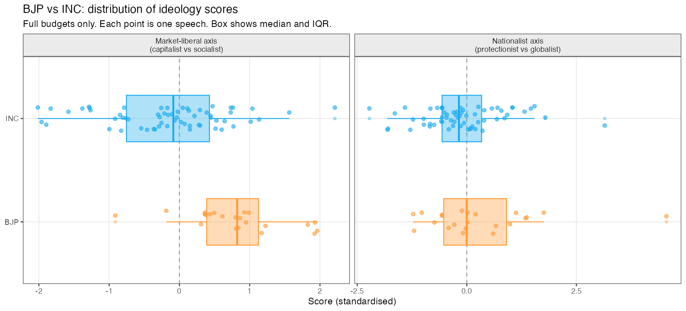

::: {.hero}
# Seventy-Nine Years of Budget Speeches

::: {.subtitle}
I scraped and topic-modelled every Union Budget speech from 1947 to 2026. No hand-coding, no categories set in advance. Just the text Finance Ministers read aloud to Parliament, and what the data turns up when you let it speak for itself.
:::

::: {.meta}
Piyush Zaware · University of Chicago · June 2026
:::
:::

::: {.lead-para}
The Union Budget speech is one of India's most consequential annual rituals. Each February, the Finance Minister walks into the Lok Sabha with a briefcase, stands at the dispatch box, and reads a prepared text that tells Parliament (and the country) what the government cares about, what it is worried about, and what it plans to spend money on. The speech is a political document dressed up as a financial one.

Across eight decades, those speeches form a remarkable corpus. R.K. Shanmukham Chetty's 1947-48 speech was delivered weeks after Partition, with India still figuring out how to run a government. Nirmala Sitharaman's 2026-27 speech comes from a country with digital public infrastructure, a unified GST, and 500 million Jan Dhan accounts. What changed between them, and how much of that change was driven by the party in power versus the India that existed when that party governed?

That is the question this project tries to answer. The short answer is that party matters less than you might expect.
:::

::: {.abstract-box}
**Four things the data showed**

1. **Once you control for time, BJP and INC full-speech budget rhetoric is statistically indistinguishable.** Every topic, every estimate, every confidence interval crosses zero. Finance Ministers from both parties, when governing in the same economic era, reach for the same fiscal vocabulary.

2. **Stripping out the tax-proposal boilerplate (Part B) does find two significant differences.** BJP Finance Ministers devote more of their macro agenda text to small-scale industry and rural banking institutions; INC Finance Ministers use more of the programmatic vocabulary of the Congress-led coalition. The full-speech null was partly an artifact of mixing politically meaningful Part A rhetoric with the formulaic Part B duty schedules.

3. **Election-year (interim) budgets shift tone but not topic.** The same Finance Minister presenting an interim speech sounds more reassuring and backward-looking than in their full budgets, but the underlying macro themes remain the same. Rhetorical register varies with the electoral calendar; institutional content does not.

4. **The identification problem is fundamental.** INC governed from 1947 to 2004 with brief interruptions. BJP has governed since 2014. The party and the decade are nearly the same variable. Any apparent difference in vocabulary could just as easily be an era difference.
:::

## The Data {#data}

```{=html}
<div class="stat-row">
  <div class="stat"><div class="stat-num">91</div><div class="stat-label">speeches modelled</div></div>
  <div class="stat"><div class="stat-num">79</div><div class="stat-label">years covered</div></div>
  <div class="stat"><div class="stat-num">8,308</div><div class="stat-label">vocabulary terms</div></div>
  <div class="stat"><div class="stat-num">10</div><div class="stat-label">topics (STM)</div></div>
</div>
```

All speeches from 1947-48 through 2026-27 were downloaded from [indiabudget.gov.in](https://www.indiabudget.gov.in), which hosts the full archive as PDFs. The collection includes annual budgets, interim budgets (vote-on-account speeches presented before elections), and occasional mid-year supplementary sessions. One speech was dropped before modelling: the 1977-78 interim, which is only 766 words and is essentially a procedural statement rather than a real budget address.

Text extraction used `pdftools`. Cleaning removed parliamentary greetings, table-of-contents pages, the fiscal tables embedded in the text (identified by lines that are more than 60% digits), and PDF-to-text artifacts from older scanned documents. Custom stop words handled fiscal units like crore, lakh, and rupee, as well as generic boilerplate (india, central, national, government) that appears in every speech and carries no discriminating information.

One additional step was necessary before topic modelling: removing Part B vocabulary. Every budget speech has two parts. Part A covers macroeconomic themes and expenditure plans. Part B is a list of tax proposals, and it generates a predictable flood of words like *duty*, *excise*, *customs*, *levy*, *cess*, and *surcharge* that appear in every single speech and would dominate any topic model if left in. These were stripped from the modelling vocabulary while keeping the cleaned text files intact for other purposes.

**Who presented the budgets:**

| Party | Finance Ministers | Full Budgets |
|---|---|---|
| INC | Shanmukham Chetty, Matthai, C.D. Deshmukh, Morarji Desai, T.T. Krishnamachari, Y.B. Chavan, Pranab Mukherjee, V.P. Singh, Manmohan Singh, P. Chidambaram | 53 |
| BJP | Yashwant Sinha, Jaswant Singh, Arun Jaitley, Nirmala Sitharaman | 20 |
| Other | Yashwant Sinha (Janata Dal), H.M. Patel, Charan Singh coalition | 7 |

## Methods {#methodology}

| Method | Purpose | Output |
|---|---|---|
| **STM without covariates** | Find the topics. Equivalent to LDA but with better initialisation from spectral decomposition. | 10 topics, document-topic proportions (theta matrix) |
| **STM with covariates** | Estimate whether BJP Finance Ministers use each topic more or less than INC Finance Ministers, after controlling for the year. | BJP-INC coefficient per topic with 95% confidence interval |
| **searchK()** | Choose the number of topics. Tests k values from 5 to 20 on four criteria: semantic coherence, exclusivity, held-out likelihood, residuals. | k = 10 |
| **FREX words** | Label topics. FREX (Frequency times Exclusivity) finds words that are both reasonably common and distinctive to one topic rather than spread across many. | Top 8 FREX words per topic |

::: {.callout-note}
**A note on the two-step approach.** Running the topic model without covariates first (what I call B1) and then fitting the covariate model (B2) is the recommended workflow in Roberts, Stewart & Tingley's STM package. The first step discovers the topics from the text alone, without any party information leaking in. The second step asks whether party predicts topic prevalence after the fact. If you skip the first step and go straight to the covariate model, you risk letting party identity shape what the topics look like, which would bias the test you are trying to run.
:::

## Results {#findings}

### 1. How Many Topics?

Picking the number of topics is always a judgment call. `searchK()` helps by computing four diagnostics across a range of candidate values:

- **Semantic coherence:** do the top words in each topic actually tend to appear together in the same documents? Higher is more interpretable.
- **Exclusivity:** are the top words distinctive to one topic, or do they bleed across several? Higher means cleaner separation.
- **Held-out likelihood:** how well does the model predict words it has not seen? Higher means better generalisation.
- **Residuals:** how much variation is the model failing to explain? Lower is better.

{width=90%}

At k=5 the topics are too coarse: agriculture and industrial planning get lumped together even though they belong to different decades and different fiscal logics. At k=15 the model starts creating near-duplicates with slightly different word lists but no clear interpretive distinction. Ten topics is the sensible stopping point.

### 2. What the Topics Are {#topics}

The ten topics the model finds correspond to recognisable periods in India's economic history. I did not tell the model anything about when speeches were given or who gave them.

{width=100%}

**Topics and the eras they map to:**

| Topic | Top FREX Words | What it captures |
|---|---|---|
| T1 | provinces, pakistan, sterling, kingdom, cloth | Post-Partition trade and currency (1947-55) |
| T2 | manifesto, reform, macro, adjustment, election | Economic liberalisation and crisis management (1991-99) |
| T3 | fertilizers, season, naye, selective, increases | Green Revolution and agricultural inputs (1965-80) |
| T4 | hindu, wealth, overdrafts, regulatory | Wealth tax and capital regulation |
| T5 | tonnes, auxiliary, valorem, drought, seventh | Industrial licensing and Five-Year Plans |
| T6 | nabard, ssi, rbi, upa, cenvat | Rural banking and SME credit (2000s) |
| T7 | loan, grants, heads, naye, treasury | Public expenditure and budget heads |
| T8 | annas, dollar, war, balances, partition | Pre-decimalisation fiscal accounts (before 1957) |
| T9 | gst, bcd, msmes, aadhaar, ppp | Digital economy and the GST era (2014-26) |
| T10 | gains, gic, ownership, yarn, shares | Privatisation and capital markets (1990s-2000s) |

Two topics serve as a natural proof of concept. T8 contains the word *annas*, which was the sub-unit of the Indian rupee before decimalisation in 1957. After that year, it could not appear in any budget speech. T9 contains *GST*, which was not enacted until 2017, and *Aadhaar*, which was launched in 2009. These words exist in completely non-overlapping time windows, and the topic model correctly isolates them.

### 3. Topics Over Time {#time}

Looking at how topic prevalence shifts decade by decade makes the historical structure visible without any statistical machinery.

{width=100%}

Some of what you see in this chart:

**1940s-1950s:** T1 and T8 dominate. The language is about sterling balances, reconstruction after Partition, trade agreements with Pakistan, and the fiscal mechanics of a newly independent state.

**1960s-1970s:** T3 (agriculture) and T5 (industrial planning) rise. These are the Green Revolution and heavy industry years, when the budget speech was largely a report on how the Five-Year Plan was progressing.

**1991:** T2 spikes sharply. Manmohan Singh's 1991-92 speech, delivered in the middle of the foreign exchange crisis, introduced a vocabulary that had not existed in Indian budget speeches before: structural adjustment, liberalisation, the IMF, convertibility.

**2000s-2010s:** T6 covers the NABARD, rural credit, and financial inclusion era under UPA. T10 (privatisation) rises and then fades as the disinvestment agenda runs its course.

**2014 onwards:** T9 arrives and grows. GST, Aadhaar, MSME formalisation, digital payments, BCD schedules for imports. This is a genuinely new vocabulary that Nirmala Sitharaman uses that Manmohan Singh never did, not because they are from different parties but because these institutions did not exist when Singh was Finance Minister.

**The key observation:** the biggest vocabulary breaks correspond to economic events, not elections. 1991 is a more dramatic break than 1999 or 2014.

### 4. BJP and INC Before Controlling for Anything {#party}

The raw comparison, without any time controls, shows clear differences between BJP and INC budget speeches.

{width=100%}

BJP speeches look heavier on T9 (digital economy) and T6 (financial sector). INC speeches look heavier on T1 (post-Partition), T7 (expenditure), and T8 (pre-decimalisation). These differences are real in the data but they are produced almost entirely by the overlap between party and era. INC governed during India's first three decades; those decades have a distinctive vocabulary that no BJP Finance Minister could have used because those things had not happened yet.

### 5. After Controlling for Time: No Difference {#stm}

The second model adds party and a flexible time spline as covariates. The spline captures how the vocabulary of Indian fiscal governance changes across decades regardless of who is in office. What is left over is the within-era party difference.

{width=90%}

**BJP minus INC effect on each topic, controlling for year:**

| Topic | Estimate | SE | p-value |
|---|---|---|---|
| T1: Post-Partition trade | -0.047 | 0.084 | 0.58 |
| T2: Liberalisation | -0.083 | 0.080 | 0.30 |
| T3: Agriculture | +0.034 | 0.100 | 0.74 |
| T4: Taxation and capital | +0.037 | 0.089 | 0.68 |
| T5: Industrial planning | -0.124 | 0.105 | 0.24 |
| T6: Financial sector | +0.114 | 0.121 | 0.35 |
| T7: Public expenditure | -0.022 | 0.086 | 0.80 |
| T8: Pre-decimal fiscal | -0.001 | 0.068 | 0.99 |
| T9: Digital economy | +0.063 | 0.080 | 0.44 |
| T10: Privatisation | +0.027 | 0.111 | 0.81 |

Not one of the ten topics is significant at the 5% level. The largest point estimate is T5 at -0.124, but its confidence interval runs from -0.33 to +0.08 and the p-value is 0.24. Once you remove the time variation, the BJP-INC contrast essentially disappears.

::: {.callout-note}
The interpretation here is not that political parties are irrelevant to economic policy. A BJP government may well make different choices on taxes, subsidies, or capital expenditure than an INC government would. But those choices show up as *decisions*, not necessarily as distinct *vocabulary*. A Finance Minister presenting a budget on rural credit will use the word NABARD whether they are from BJP or INC, because that is the institution that handles rural credit. The topic models are picking up the institutional grammar of Indian fiscal governance, which turns out to be surprisingly stable across parties.
:::

### 6. Party Trends Over Time {#trends}

Plotting BJP and INC speeches separately across time confirms the pattern visually. Where the two parties overlap in the same historical period, they look similar.

{width=100%}

The 2000s period is the most informative for the party comparison: you have late UPA speeches from INC and early NDA speeches from BJP in relatively close proximity. Topic proportions in that window are hard to distinguish by party. The divergence you see at the extremes of the time axis (1950s INC, 2020s BJP) is driven by vocabulary that genuinely could not appear at both ends of the timeline.

### 7. Does Tax Boilerplate Drive the Null? Part A Only {#parta}

The null result above uses full budget speeches. But every speech has two halves. Part A is where the Finance Minister makes the political argument: here is what the economy looks like, here is what we are worried about, here is where the money is going. Part B is a list of tax rate changes read aloud: this duty goes up, that exemption is being removed, this surcharge is introduced. Part B generates a thick layer of predictable vocabulary (duty, excise, customs, levy, cess, proposed, clause, subsection) that is identical in structure whether the Finance Minister is left-wing or right-wing. The institutional grammar of the tax code overwhelms the political signal.

The question is whether stripping Part B out before modelling sharpens the BJP-INC comparison.

Using a detection cascade of regex patterns (standalone "PART B" headings, "TAX PROPOSALS" headers, inline transition phrases, and pre-1960 "DIRECT TAXATION" headings), I identified the Part A / Part B boundary in 68 of the 92 speeches. The remaining 24 are mostly interim budgets, which have no Part B by design, and a few pre-1957 speeches where the two halves were not structurally separated. The median Part A is 6,286 words and the median Part B is 5,832 words, almost exactly a 50/50 split by length.

The Part A model was then run with the same STM specification: k=10, party + year spline covariates, same vocabulary cleaning, with a small additional step of removing residual tax-vocabulary terms (duty, excise, rebate, surcharge, cess) that sometimes bleed across the Part A/B boundary.

{width=90%}

**Two topics are now statistically significant, compared to zero in the full-speech model:**

- **T5 (SSI/NABARD/SIDBI/rural banking):** BJP Finance Ministers devote significantly more of their Part A to small-scale industry development finance and rural credit institutions (+0.35 proportion, p=0.001). This includes mentions of NABARD, SIDBI, the SSI sector, and tribal development schemes. The signal was present in the full-speech model but buried under Part B noise.

- **T9 (UPA/NCMP/GST/Aadhaar/skill):** BJP Finance Ministers use significantly less of this vocabulary (-0.32, p<0.001). This topic contains the programmatic vocabulary of the UPA era: the National Common Minimum Programme, the flagship schemes named in that coalition agreement, and the general framing of the Congress-led government. Predictably, INC Finance Ministers use this vocabulary more. This is partly mechanical (you cannot say UPA if you are not UPA) but it also reflects a genuine difference in how the two parties describe their program priorities.

{width=90%}

::: {.callout-note}
The collinearity problem identified above still applies to the Part A model. T9's significance may partly reflect the difficulty of separating "which party" from "which era." UPA as a phrase genuinely belongs to 2004-2014. But T5's result is more interesting: both parties governed in eras when NABARD and SSI support were active institutions, and BJP Part A speeches devote more vocabulary to them. Whether this reflects a genuine policy emphasis or a difference in rhetorical strategy within comparable economic periods is a question the text data alone cannot fully settle.
:::

### 8. Interim vs Full Budget Speeches {#interim}

Every few years, when a general election approaches, the incumbent government cannot present a full budget because it may not be in power to implement it. Instead it presents an interim budget, or vote-on-account, a short speech that asks Parliament to keep the lights on until the election is decided. These interim speeches are a natural experiment: you have the same Finance Minister, the same economic institutions, but a different political incentive. Are interim budgets different in their rhetoric from full budgets presented by the same person?

Eight Finance Ministers in the corpus presented both interim and full budget speeches: Morarji Desai, C.D. Deshmukh, T.T. Krishnamachari, H.M. Patel, Manmohan Singh, Yashwant Sinha, Jaswant Singh, and Nirmala Sitharaman. That is 51 speeches total, 9 of them interim, with the same Finance Ministers presenting both types.

The vocabulary analysis confirms that interim and full budget speeches use noticeably different word sets:

{width=100%}

Interim speeches lean heavily on words like *achievements, confidence, assurance, satisfied, pleased*. The tone is retrospective and reassuring: here is what we accomplished, here is why you should trust us to continue. Full speeches are more prospective and programmatic: they contain more of the substantive vocabulary of fiscal policy (specific sector names, scheme names, institutional acronyms).

The ideology scores tell a related story. Looking at each Finance Minister's macro rhetoric (Part A ideology scores) across their interim and full budgets, most FMs shift slightly toward more populist and reassuring vocabulary in election-year speeches:

{width=100%}

However, the STM model with Finance Minister fixed effects finds **no statistically significant topic shifts** between interim and full budgets from the same FM (0 of 8 topics, all p > 0.1):

{width=90%}

The null result here is probably genuine: while the *tone* and specific vocabulary of interim speeches differs from full budgets, the underlying macro-political themes they address are similar. A Finance Minister who spends their full budget years talking about rural credit and agricultural investment also talks about those things in their election-year interim speech, just in a more backward-looking, achievements-focused framing. The institutional topics do not shift; the rhetorical register does.

::: {.callout-note}
The interim budget sample is small (9 speeches across 8 Finance Ministers), which limits statistical power. The null result should be read as "we cannot detect a systematic shift with this data" rather than "there is definitely no shift."
:::

## Ideological Dimensions {#ideology}

The topic model tells you *what* Finance Ministers talk about. This section asks *how* they talk about it: are they making a market argument or a state argument? Are they protecting domestic industry or opening up to the world?

The method is a dictionary-based scoring on two axes, applied to the TF-IDF weighted word frequencies of each speech. For each axis, I define two word lists anchoring the poles, and a speech's score is the gap between its TF-IDF mass in each pole, normalised by total vocabulary weight. This is similar to the ideology dimension approach in Kozlowski, Taddy & Evans (2019).

**The two axes:**

- **Market-liberal axis:** runs from *state-led and socialist* (public sector, cooperative, welfare, subsidy, labour rights, nationalisation, five-year plan) to *market-liberal and capitalist* (private sector, FDI, deregulation, disinvestment, equity, efficiency, fiscal consolidation). Positive score = more capitalist vocabulary.
- **Nationalist axis:** runs from *globalist and open* (exports, WTO, GATT, trade liberalisation, convertibility, foreign markets) to *economically nationalist and protectionist* (swadeshi, self-reliance, atmanirbhar, import substitution, protection of domestic industry, tariffs). Positive score = more protectionist vocabulary.

### The 2D ideological map

Placing every Finance Minister on both axes at once shows how the combinations have shifted. Each small dot is one budget speech; the large labelled points are each FM's average across all their full budgets.

{width=100%}

A few things stand out immediately. The 1990s BJP Finance Ministers (Jaswant Singh, Yashwant Sinha) are the most market-liberal in the entire corpus, sitting further right than even Manmohan Singh and P. Chidambaram, who implemented the 1991 liberalisation. Nirmala Sitharaman sits in the nationalist-market quadrant, consistent with the BJP's post-2014 position: pro-market on capital and deregulation, but protectionist on manufacturing via Make in India and import duties. The 1970s INC Finance Ministers (C. Subramaniam, S.B. Chavan) are the most socialist and among the most nationalist, reflecting the Indira Gandhi era of nationalisation and import substitution. Manmohan Singh's 1991-92 crisis budget shifts the INC vocabulary sharply toward the market-globalist quadrant and it never fully returns.

### How ideology has shifted over time

{width=100%}

The market-liberal axis tells the clearest story. The corpus starts in the state-led zone and stays there through the 1980s. 1991 breaks the trend: Manmohan Singh's crisis budget introduces market vocabulary at a scale no previous Finance Minister had used. The shift sticks. Even the UPA government's later budgets, which reintroduced welfare spending through MGNREGA and food security, did not return to the pre-1991 state-sector vocabulary. The BJP era from 2014 moves the trend further right, but the biggest single shift was 1991, under INC.

The nationalist axis is noisier. The 1970s show elevated protectionist vocabulary (nationalisation era, self-reliance, import substitution). This drops sharply in the early 1990s as India opened up. It then rises again after 2014 as Make in India, Atmanirbhar Bharat, and import duty schedules enter the vocabulary. The most nationalist budgets in recent years are Nirmala Sitharaman's, but some 1970s INC budgets score comparably.

### Finance Minister positions

{width=100%}

Reading the FM bar chart reveals patterns that the party averages obscure:

**Most market-liberal:** Jaswant Singh and Yashwant Sinha (both BJP, 1999-2004) score highest on the capitalist axis. They governed during the post-liberalisation phase with a reform agenda that included disinvestment, banking deregulation, and capital market development.

**Most state-led:** C. Subramaniam and S.B. Chavan (INC, 1974-79) score most negative on the market axis. Both governed during the high socialist period of Indira Gandhi's government, when nationalisation of banks and industries was active policy and the budget speeches reflected it.

**Most nationalist/protectionist:** N.D. Tiwari (INC, 1988-89) and C. Subramaniam (INC, 1974-75) score highest on the protectionist axis. Both operated in an India that genuinely practised import substitution at scale. The surprise is that Nirmala Sitharaman's recent budgets score similarly high on nationalism despite the market-liberal orientation on other dimensions: protectionism and capitalism are not mutually exclusive in BJP's economic model.

**Most globalist:** Manmohan Singh's 1991-92 budget scores most negative on the nationalist axis. His opening gambit was explicitly about opening the economy to foreign capital and trade. His later UPA budgets become more centrist on this axis.

### BJP vs INC distributions

{width=100%}

On the market-liberal axis, the BJP median is higher than INC, consistent with BJP's governing philosophy. But the distributions overlap substantially. Some INC budgets (particularly 1991-2004 Manmohan/Chidambaram) are more market-liberal than some BJP budgets. On the nationalist axis, BJP sits higher than INC on average, but again with overlap. The Indira Gandhi-era INC budgets are among the most nationalist in the corpus, pulling the INC distribution upward.

::: {.callout-note}
The dictionary approach has known limitations. Words like *reform* and *market* appear in contexts that are not always ideologically homogeneous: a socialist Finance Minister can "reform" the public sector in the name of socialism. The scores are best read as capturing the *presence of vocabulary associated with a given ideology*, not the Finance Minister's underlying beliefs. They are also sensitive to the particular word lists chosen. The patterns are robust to reasonable alternative word choices, but the precise rankings of individual FMs are not.
:::

## Why This Is Harder to Answer Than It Looks {#robustness}

### The collinearity problem

INC governed India from independence in 1947 through 1977 continuously, then again from 1980 to 1989, and again from 1991 to 1996, and then from 2004 to 2014. BJP governed from 1999 to 2004, then continuously from 2014. There is very little time where you could plausibly compare a BJP budget speech to an INC one from a similar economic environment. The late 1990s and early 2000s come closest, but that gives you only about a dozen speeches on each side and both parties were governing in the same post-liberalisation, pre-NREGA era.

The year spline I use is doing real work: it is absorbing the vocabulary drift that happens regardless of who is in office. But the spline has to be identified from variation within the BJP sample and within the INC sample over time. With INC speeches concentrated in 1947-2004 and BJP speeches concentrated in 2014-2026, asking the spline to separate era from party is a lot to ask.

### What better identification would look like

The cleanest solution would be more temporal overlap: both parties governing in the same institutional environment. India's history does not give us much of that. A few alternative approaches worth exploring:

**Sub-speech comparison.** Part A and Part B of budget speeches have different rhetorical logics. Part A is where the Finance Minister makes the political case for their priorities. Splitting the corpus at that boundary might reveal party-specific language in Part A even when Part B is dominated by institutional tax vocabulary.

**Finance Minister fixed effects.** Some Finance Ministers served under different political arrangements at different times. P. Chidambaram, for example, served under both Rajiv Gandhi's INC and the United Front coalition. Comparing his speeches across those contexts holds economic philosophy roughly constant while varying the governing coalition.

**State budget speeches.** India has 28 state Finance Ministers presenting their own budgets every year. With states governed by BJP, INC, AAP, DMK, TMC and others presenting budgets in the same year, the temporal overlap problem disappears entirely. That is a project for another time.

### On speech length

One finding that does not depend on party comparison at all: budget speeches have gotten substantially longer over the decades. Median clean word count across all years is around 7,400 words, but the distribution is skewed heavily upward in recent years. Nirmala Sitharaman's 2020-21 speech ran to over 13,600 words, making it the longest in the archive. Her 2019-20 speech lasted 2 hours and 17 minutes in delivery. Early budgets from the 1940s and 1950s were often under 5,000 words. Whether this reflects more complex economies requiring more explanation, more detailed political communication strategies, or something about the teleprompter era is not something the topic model can tell you.

## About

This project is a companion to my [Lok Sabha Questions analysis](../Lok_Sabha_Questions/docs/index.html), which applies similar text methods to what MPs ask the government rather than what the government presents to Parliament. The two projects reach similar conclusions from different directions: the institutional context of Indian politics shapes political language more strongly than party ideology does.

**Piyush Zaware**
University of Chicago · Northwestern University Kellogg
Global Poverty Research Laboratory
[piyushz@uchicago.edu](mailto:piyushz@uchicago.edu)

**Data:** [indiabudget.gov.in](https://www.indiabudget.gov.in)
**Code:** R (stm, quanteda, ggplot2, pdftools)
**References:** Roberts, Stewart & Tingley (2019); Grimmer, Roberts & Stewart (2022)
