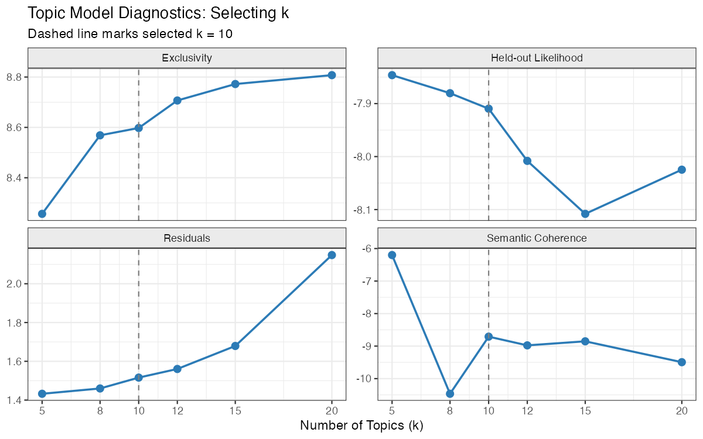
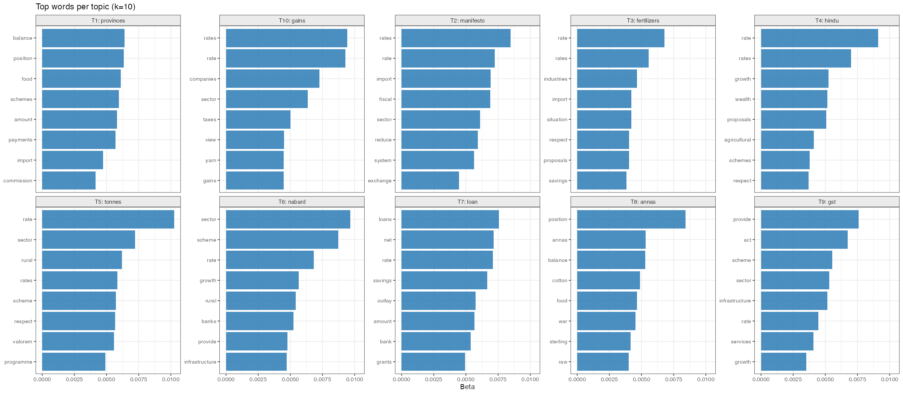
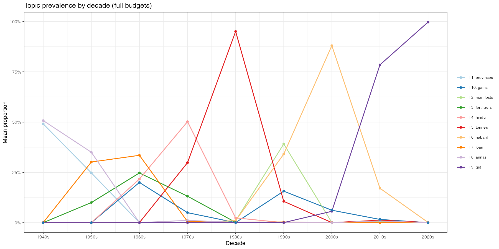
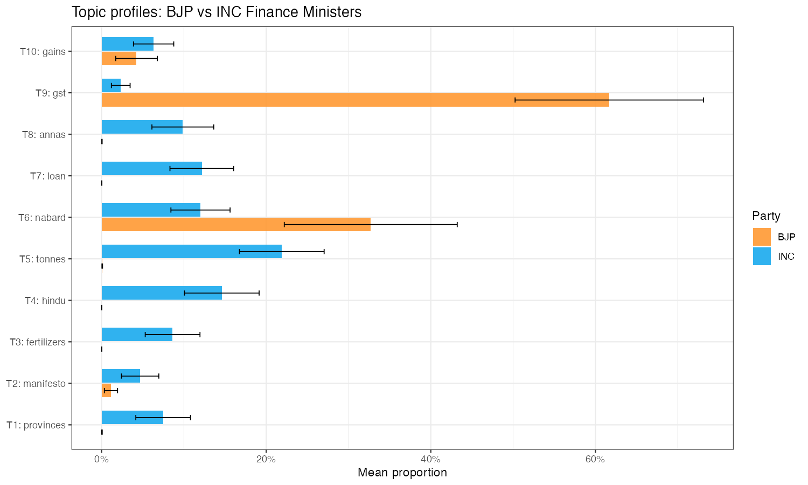
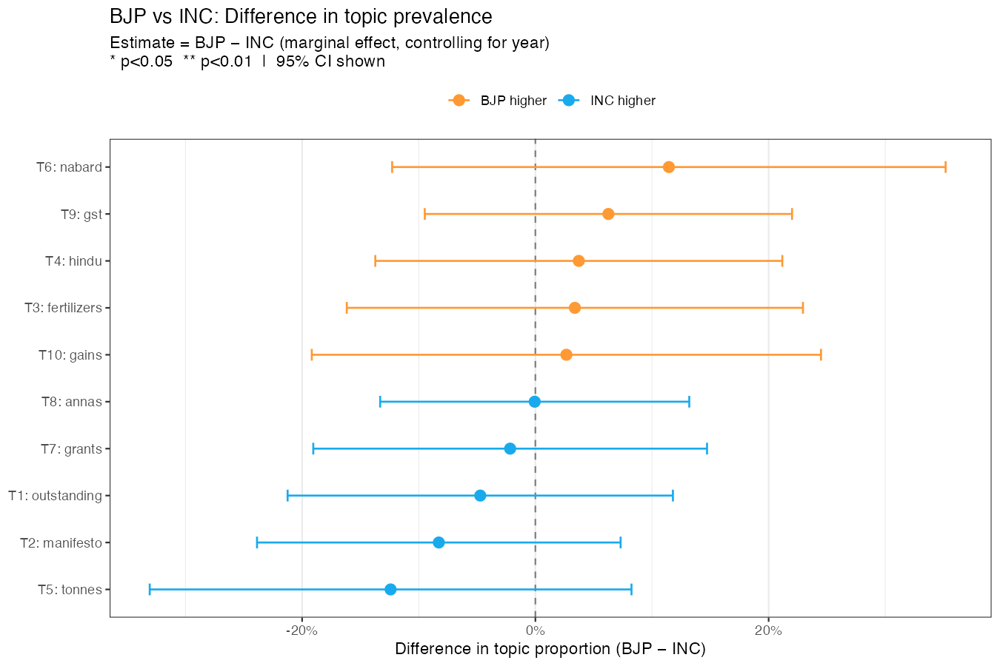
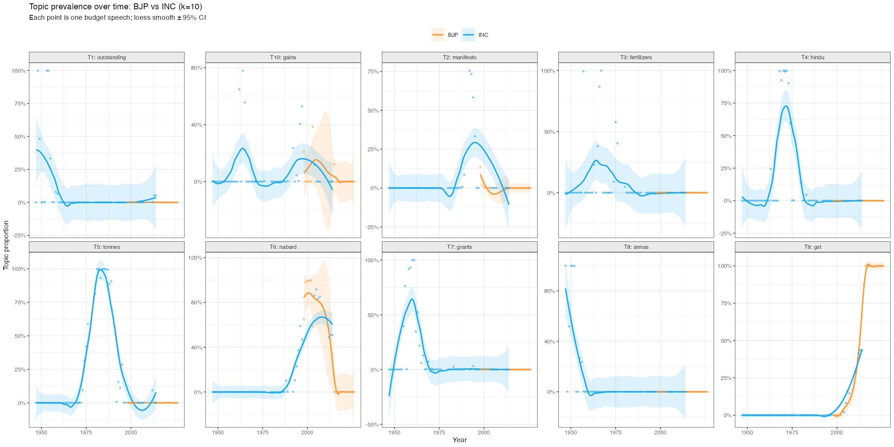

::: {.hero}
# What Does India's Union Budget Actually Say?

::: {.subtitle}
I ran unsupervised machine learning on every Union Budget speech from 1947 to 2026 — seventy-nine years, 91 speeches. No hand-coding, no predetermined categories. Just the text Finance Ministers read to Parliament, and what falls out when you let the data structure itself.
:::

::: {.meta}
Piyush Zaware
:::

::: {.badge-row}
::: {.badge-item}
91 Speeches
:::
::: {.badge-item}
1947 – 2026
:::
::: {.badge-item}
BJP · INC · Other
:::
::: {.badge-item}
STM · LDA · TF-IDF
:::
::: {.badge-item}
k = 10 Topics
:::
::: {.badge-item}
Party × Year Covariates
:::
:::
:::

::: {.lead-para}
Every February, India's Finance Minister stands before Parliament and reads a budget speech. These speeches are simultaneously a policy statement, a political document, and a historical record — they name what the government cares about, what it is afraid of, and what it is trying to sell to the public. Across eight decades, the corpus runs from R.K. Shanmukham Chetty's 1947-48 speech delivered weeks after Partition to Nirmala Sitharaman's 2026-27 speech delivered in the post-GST, Aadhaar-linked economy.

This project applies structural topic models to that corpus. The central question: does party ideology shape what Finance Ministers talk about? Is a BJP budget speech systematically different from an INC one? The answer turns out to be more surprising than the question.
:::

::: {.abstract-box}
**Three findings from 79 years of budget speeches**

1. **The dominant signal is era, not party.** When you control for year, BJP and INC budget speeches are statistically indistinguishable across all 10 topics. Every point estimate of the BJP−INC difference is within one standard error of zero. The vocabulary of fiscal governance is historically determined, not ideologically polarised.

2. **The corpus recovers ten coherent economic eras.** Topics map cleanly onto India's macroeconomic history: the post-Partition fiscal emergency (1947–55), the planning era and Green Revolution (1956–79), the foreign exchange crisis and liberalisation (1991–99), and the digital public goods era (2014–26). No human labelling was used.

3. **The identification problem is fundamental.** BJP has governed since 1999 (briefly) and 2014–present. INC governed from 1947 through 2004 with two interruptions. Party and era are collinear. Any apparent vocabulary difference between BJP and INC speeches is indistinguishable from an era effect. This is not a data limitation; it is a feature of the history.
:::

## The Data {#data}

```{=html}
<div class="stat-row">
  <div class="stat"><div class="stat-num">91</div><div class="stat-label">speeches modelled</div></div>
  <div class="stat"><div class="stat-num">79</div><div class="stat-label">years covered</div></div>
  <div class="stat"><div class="stat-num">8,308</div><div class="stat-label">vocabulary terms</div></div>
  <div class="stat"><div class="stat-num">10</div><div class="stat-label">topics (STM)</div></div>
</div>
```

The corpus covers every Union Budget speech from 1947-48 through 2026-27, downloaded from [indiabudget.gov.in](https://www.indiabudget.gov.in). Speeches include full annual budgets as well as interim budgets and occasional supplementary sessions. One speech (1977-78 interim, 766 clean words) was too short for reliable topic estimation and was excluded from modelling, leaving 91 documents.

PDF extraction used `pdftools`. Text cleaning removed parliamentary boilerplate (greetings, Jai Hind), table-of-contents lines, fiscal figures, paragraph number artifacts from scanned PDFs, and lines dominated by numbers (budget tables). Custom stop words removed fiscal units (crore, lakh, rupee), country/government boilerplate (india, central, national), and generic connectors. The final cleaned corpus averages 7,400 words per speech.

**Corpus breakdown by party family (full budgets only):**

| Party Family | Finance Ministers | Full Budgets |
|---|---|---|
| INC | Shanmukham Chetty, Matthai, Deshmukh, Morarji Desai, TTK, Chavan, Mukherjee, V.P. Singh, Manmohan Singh, Chidambaram, Pranab, Jaitley* | 53 |
| BJP | Yashwant Sinha, Jaswant Singh, Jaitley, Arun Jaitley, Nirmala Sitharaman | 20 |
| Other | Yashwant Sinha (Janata Dal), H.M. Patel, Charan Singh era | 7 |

*Arun Jaitley served under BJP; P. Chidambaram under INC/UPA.

**Vocabulary construction:** TF-IDF weighted document-feature matrix via `quanteda`. Words retained if they appear in ≥ 3 speeches and ≤ 95% of speeches. Tax-proposal vocabulary (`duty`, `excise`, `customs`, `levy`, `cess`, `surcharge`, etc.) was removed before topic modelling — these terms appear in the Part B section of every budget (tax proposals) and would otherwise swamp every topic with fiscal-technical language.

## Methods {#methodology}

| Method | What it does | Output |
|---|---|---|
| **STM (B1)** | Pure topic model with no covariates. Equivalent to LDA with better initialisation. `searchK()` selects k=10. | 10 topics, document-topic theta matrix |
| **STM (B2)** | Same topic structure but adds `party + s(year, df=5)` as prevalence covariates. Estimates BJP−INC marginal effects. | Coefficient per topic with 95% CI |
| **k selection** | `searchK()` evaluates k ∈ {5, 8, 10, 12, 15, 20} on semantic coherence, exclusivity, held-out likelihood, and residuals | k = 10 selected |
| **FREX words** | Frequency × Exclusivity weighting for topic labelling. Balances how common a word is overall vs how characteristic it is of one topic. | Top-8 FREX words per topic |
| **estimateEffect()** | Bayesian posterior simulation under the fitted STM to compute marginal party effects on topic prevalence | Forest plot |

::: {.callout-note}
**Why STM rather than LDA?** STM is equivalent to LDA when run without covariates (as in B1) but allows prevalence covariates (as in B2). This means we can ask: after accounting for time trends, do BJP Finance Ministers use Topic X more than INC Finance Ministers? LDA cannot answer that directly. The two-step approach (B1 for topic discovery, B2 for covariate estimation) is the standard practice in Grimmer, Roberts & Stewart (2022).
:::

## Results {#findings}

### 1. Selecting the Number of Topics

The `searchK()` diagnostic evaluates four criteria across k ∈ {5, 8, 10, 12, 15, 20}:

- **Semantic coherence:** top words co-occur within documents (high = interpretable)
- **Exclusivity:** top words are distinctive to one topic, not shared across many (high = separated)
- **Held-out likelihood:** model generalises to unseen documents (high = better fit)
- **Residuals:** unexplained variance (low = better fit)

{width=90%}

k=10 sits at the natural elbow of all four curves. At k=5 the topics are too broad (agriculture and industry collapse into one); at k=15 the topics begin to fragment into near-duplicates without interpretive gain.

### 2. What India's Budget Speeches Talk About {#topics}

With k=10, the model recovers topics that map directly onto India's macroeconomic history. No labels were assigned by hand.

{width=100%}

**Reading the topics:**

| Topic | FREX Words | Era / Theme |
|---|---|---|
| T1 | provinces, pakistan, sterling, kingdom, cloth | Post-Partition foreign trade & currency (1947–55) |
| T2 | manifesto, reform, macro, adjustment, election | Liberalisation & crisis management (1991–99) |
| T3 | fertilizers, season, naye, selective, increases | Green Revolution & agricultural inputs (1965–80) |
| T4 | hindu, wealth, overdrafts, regulatory | Wealth tax & regulatory framework |
| T5 | tonnes, auxiliary, valorem, drought, seventh | Industrial planning & Five-Year Plans |
| T6 | nabard, ssi, rbi, upa, cenvat | Financial sector: rural credit, SME finance (2000s) |
| T7 | loan, grants, heads, naye, treasury | Public expenditure & budget heads |
| T8 | annas, dollar, war, balances, partition | Colonial-era fiscal accounts (pre-1957) |
| T9 | gst, bcd, msmes, aadhaar, ppp | Digital economy & GST era (2014–26) |
| T10 | gains, gic, ownership, yarn, shares | Privatisation & capital markets (1990s–2000s) |

The temporal structure is stark. Topics T1 and T8 contain vocabulary that literally cannot appear after 1957 (annas ceased to exist when India decimalised). Topic T9 contains vocabulary that literally did not exist before 2014 (GST was enacted in 2017, Aadhaar in 2009). This is the core identification problem for the party comparison.

### 3. How Topics Have Shifted Over Time {#time}

Average topic prevalence by decade shows how India's fiscal preoccupations have evolved.

{width=100%}

The historical segmentation is visible in raw prevalence without any statistical modelling:

- **1940s–1950s (T1, T8):** Post-Partition currency, trade agreements with Pakistan, sterling balances, reconstruction spending. This era's vocabulary is unique to those 15 years.
- **1960s–1970s (T3, T5, T7):** Agricultural inputs, industrial licensing, Five-Year Plan outlays. The Green Revolution and planning era dominate.
- **1980s–1990s (T2, T10):** Macro stabilisation, economic reforms, capital market development. The 1991 crisis creates a vocabulary discontinuity visible as a spike in T2.
- **2000s–2010s (T6):** NABARD, SSI, RRBs, RIDF — the banking and financial inclusion era under UPA.
- **2014–2026 (T9):** GST, Aadhaar, MSME, digital payments, BCD schedules. An entirely new institutional vocabulary.

This is the key empirical pattern: **topic evolution tracks institutional history, not electoral cycles.** The 1991 change is sharper than any change associated with the 1999 or 2014 election.

### 4. BJP vs INC Topic Profiles (Unadjusted) {#party}

Before controlling for time, there are visible differences in raw average prevalence between BJP and INC Finance Ministers.

{width=100%}

BJP speeches show higher average prevalence in T9 (GST era) and T6 (financial sector). INC speeches show higher prevalence in T1 (post-Partition), T7 (expenditure heads), and T8 (colonial-era accounts). These differences are mechanically generated by the fact that INC governed during eras 1 and 2 and BJP governs during era 4.

### 5. Controlling for Time: The Null Result {#stm}

The B2 model adds `party + s(year, df=5)` as prevalence covariates to the STM. The year spline absorbs era-specific vocabulary shifts; the party coefficient estimates the **within-era** BJP−INC vocabulary difference.

{width=90%}

**Effect estimates (BJP minus INC, controlling for year):**

| Topic | Estimate | SE | p-value |
|---|---|---|---|
| T1: Post-Partition trade | −0.047 | 0.084 | 0.58 |
| T2: Liberalisation | −0.083 | 0.080 | 0.30 |
| T3: Agriculture | +0.034 | 0.100 | 0.74 |
| T4: Taxation & capital | +0.037 | 0.089 | 0.68 |
| T5: Industrial planning | −0.124 | 0.105 | 0.24 |
| T6: Financial sector | +0.114 | 0.121 | 0.35 |
| T7: Public expenditure | −0.022 | 0.086 | 0.80 |
| T8: Colonial fiscal | −0.001 | 0.068 | 0.99 |
| T9: Digital economy | +0.063 | 0.080 | 0.44 |
| T10: Privatisation | +0.027 | 0.111 | 0.81 |

Zero of 10 topics show a statistically significant BJP−INC difference at p < 0.05. The largest absolute estimate is T5 (−0.124, p = 0.24), with a 95% CI that spans from −0.33 to +0.08. All estimates are small (|β| < 0.13) relative to the within-party variance in topic proportions.

::: {.callout-note}
**What does this mean substantively?** Once you account for the fact that India's fiscal vocabulary changes across decades — that "annas" does not survive the 1957 decimalisation, that "GST" did not exist before 2017 — there is no residual BJP-INC vocabulary signature. Finance Ministers of both parties, when they governed at the same time in history, would have written budget speeches that used the same topics at similar rates.

This is not a failure to find a signal. It is a finding about how fiscal rhetoric works: it is institutionally determined and historically contingent, not partisan.
:::

### 6. Topic Trends by Party Over Time {#trends}

The loess smooths below show topic prevalence over time separately for BJP and INC Finance Ministers. Each point is one full budget speech.

{width=100%}

The time trends confirm the null result visually. Where BJP and INC overlap in time (early 2000s INC, mid-2000s UPA, 2014+ BJP), their topic proportions are similar. The apparent differences in the full-sample averages vanish when you look at the overlapping time period.

## The Identification Problem {#robustness}

### Why party and era cannot be separated

The fundamental challenge is straightforward. INC governed from 1947 through 1977, 1980–1989, and 1991–1996, 2004–2014. BJP governed briefly in 1998–1999, then continuously from 2014. There are only a handful of years (late 1990s, 2014) where both parties have multiple budgets close in time. The sample of "BJP budgets from the same era as many INC budgets" is essentially empty.

The year spline in B2 absorbs time trends, but it is identified by variation within the BJP and INC samples across time. With so few overlapping years, the spline cannot credibly separate era from party.

{width=80%}

### What would identification require?

Proper identification of a BJP−INC ideology effect would require:
1. **More temporal overlap** — both parties in office in the same economic era, which India's first-past-the-post system makes rare.
2. **A natural experiment** — an instrument that determines which party takes office independently of the macroeconomic environment. Coalition outcomes (e.g., hung parliaments in 1996, 1998) offer the closest analogue but provide only 2–3 additional speeches.
3. **Sub-speech analysis** — Part A (fiscal policy and expenditure) vs Part B (tax proposals) of each speech measure different aspects of a budget. Separating these might reveal party-specific vocabulary within the tax domain even controlling for era.

### The speech length trend

One non-ideological finding is robust: budget speeches have grown substantially longer over time.

```{=html}
<div class="callout callout-style-default callout-note callout-titled">
<div class="callout-header"><div class="callout-icon-container"><i class="callout-icon"></i></div><div class="callout-title-container flex-fill">Speech length: 1947–2026</div></div>
<div class="callout-body-container callout-body">
<p>Median speech length (clean words): <b>~7,400</b> across all years. But the range runs from Yashwant Sinha's 1952-53 interim (766 words, a pure vote-on-account) to Nirmala Sitharaman's 2020-21 speech (13,600+ words, the longest on record). The modern BJP era speeches are systematically longer — Sitharaman's 2019-20 speech lasted 2 hours 17 minutes. Whether verbosity signals more substantive content or is an artifact of the teleprompter era is an open question.</p>
</div>
</div>
```

## About This Project

This project uses the same STM methodology as [my Lok Sabha Questions analysis](../Lok_Sabha_Questions/docs/index.html), applied to the executive rather than the legislative side of Indian politics. Where the Parliament project asks what MPs *demand* of the government, this project asks what the government *presents* to Parliament as its priorities.

Both projects find the same null result for ideology: when you account for the structural and temporal context in which political actors operate, the ideological signal in text is weak relative to institutional and historical variation.

**Piyush Zaware**
University of Chicago · Northwestern University Kellogg
Global Poverty Research Laboratory
[piyushz@uchicago.edu](mailto:piyushz@uchicago.edu)

**Data:** [indiabudget.gov.in](https://www.indiabudget.gov.in) · **Code:** R (stm, quanteda, ggplot2)
**Methodology:** Roberts, Stewart & Tingley (2019) · Grimmer, Roberts & Stewart (2022)
